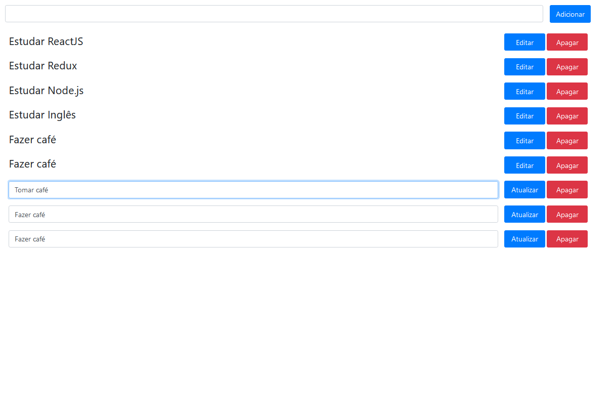

<h1 align="center">
 
 
  Lista de tarefas
</h1>

Adicione, edite e atualize tarefas diárias.

  

## Tecnologias
Tecnologias usadas no projeto.
- ⚛️ **ReactJS**
- ⚛️ **Redux**

## Começando

1. Clone o repositório `git clone https://github.com/Iago-s/redux-todo.git`
2. Vá para a pasta criada `cd redux-todo`
3. Instale as dependências `npm install`
4. Execute o projeto `npm start`